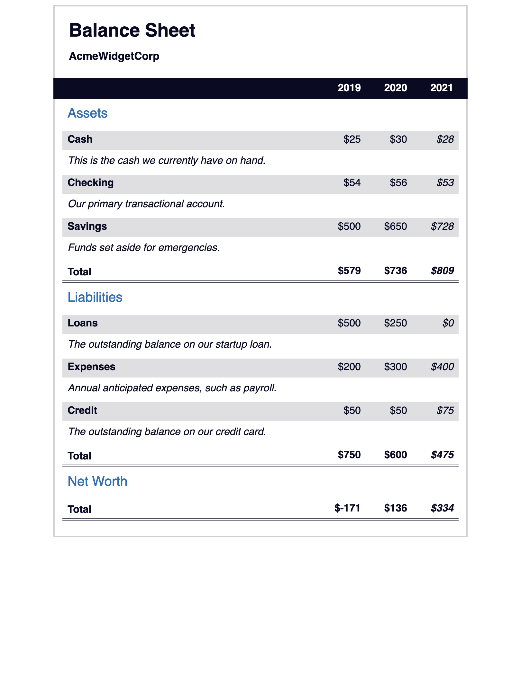
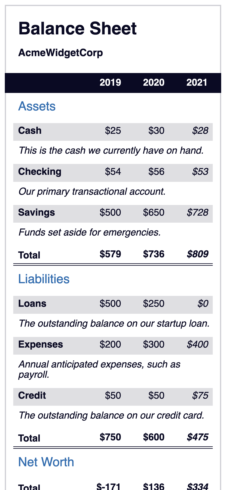

# Balance Sheet Page

This repository contains the HTML and CSS for the **Learn More About CSS Pseudo Selectors By Building A Balance Sheet** course by [freeCodeCamp](https://www.freecodecamp.org/learn/2022/responsive-web-design/).

CSS pseudo selectors can be used to change specific HTML elements.

The `index.html` file contains HTML tags and appropriate classes to use to structure and manipulate the elements on the page.

The `css/styles.css` file is used with an emphasis on pseudo selectors. The project allows one to learn how to change the style of an element when one hovers over it with the mouse, and trigger other events on the webpage.

The page can be viewed here: [Balance Sheet](https://remicoding.github.io/balance-sheet-page/)

For your convenience, here are screenshots of the page:

